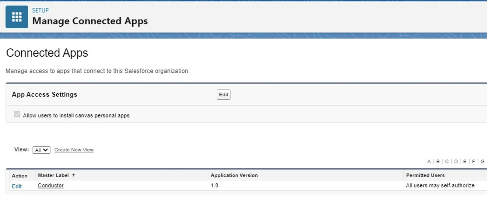
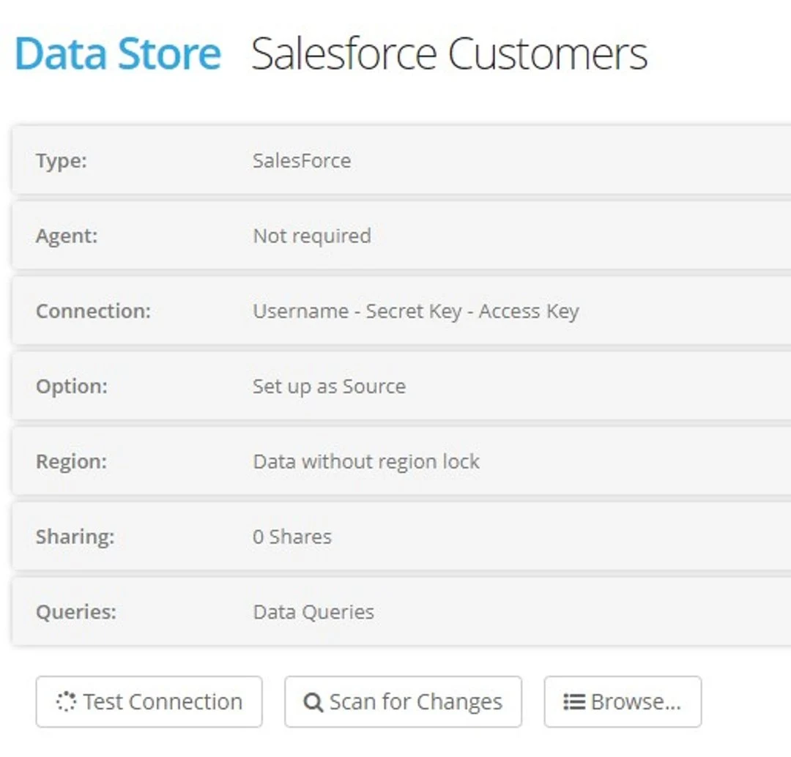

## Salesforce Account Access

In order to connect Eightwire must be created as a connected app using the Salesforce Platform Tools.

Connected App Name \_\_\_\_\_\_\_\_\_\_\_\_\_\_

API Name \_\_\_\_\_\_\_\_\_\_\_\_\_\_

Contact Email \_\_\_\_\_\_\_\_\_\_\_

Check to **‘Enable OAuthSettings’**

Enter  **Callback URL**

https://login.salesforce.com/services/oauth2/callback

Add **Full Access** to Selected OAuth Scopes

Check **‘Require Secret for Web Server Flow’**

## Create a Datastore

From the Datastore Page click **+New**

Name your Datastore and select **‘In the cloud’** and **‘Salesforce’**

**Connection**

**UserName** — User that has access to your Salesforce Account

**Password —** User Password+SecurityToken

**SecretKey —** Consumer Secret for the API

**AccessKey —** Consumer Key for the API

**Option —** Choose Source or Destination

**Region Lock —** Select a processing Region (recommended)

Click **CREATE**

Test and Scan the Datastore

## Process Types

The following process types are supported;

Source Datastore

-   Read from a Custom Object
-   Read from a Standard Object

Destination Datastore

-   Overwrite to an Standard or Custom Object
-   Append to a Standard or Custom Object
-   Merge New and Changed to a Custom Object
