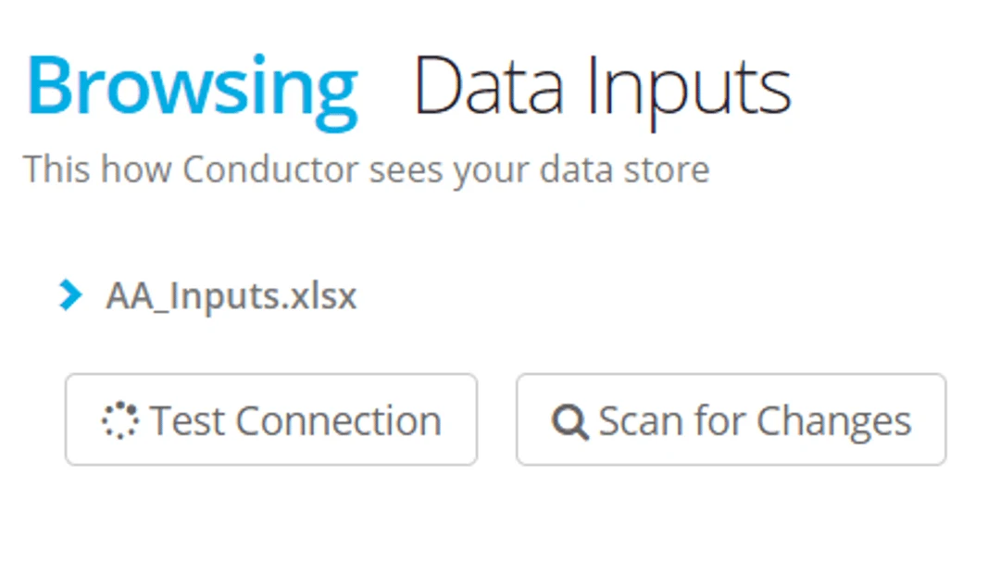
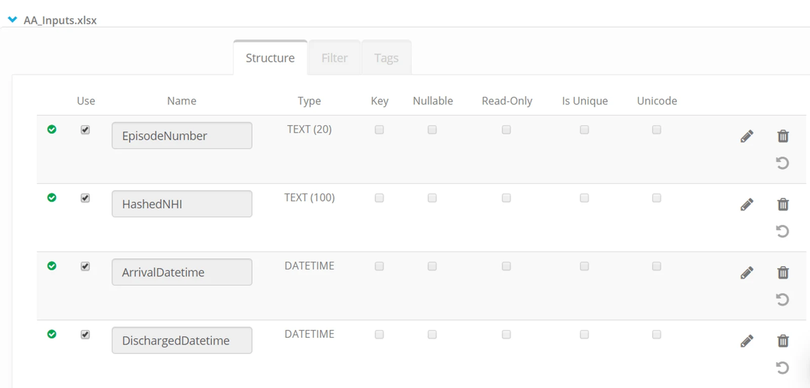
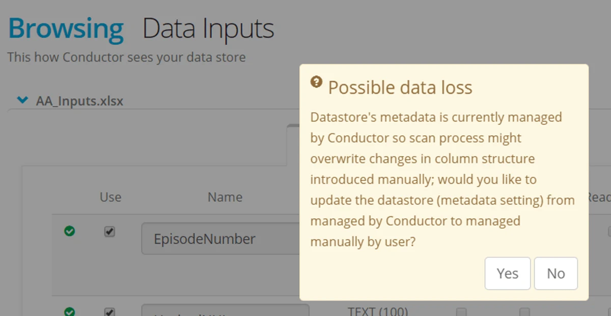
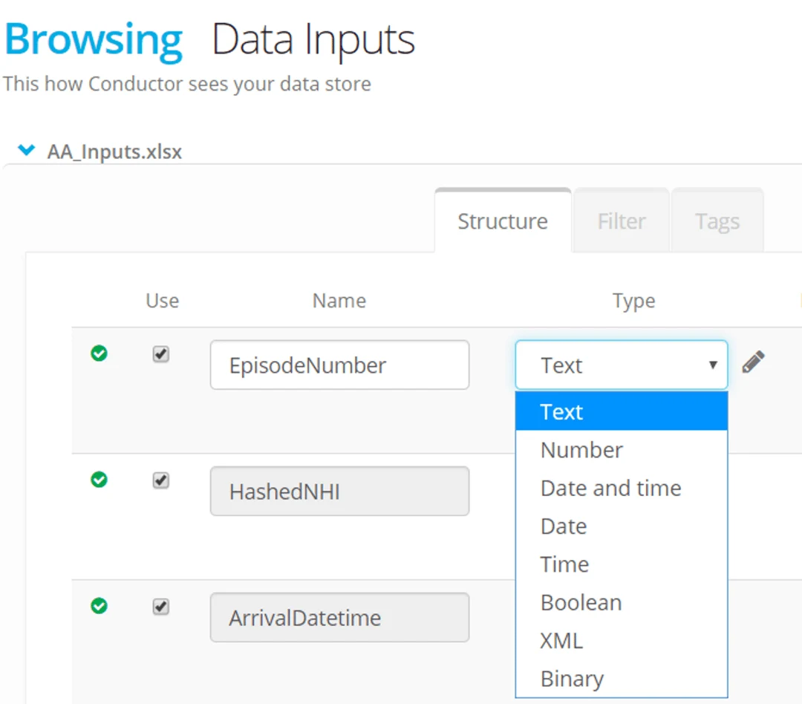
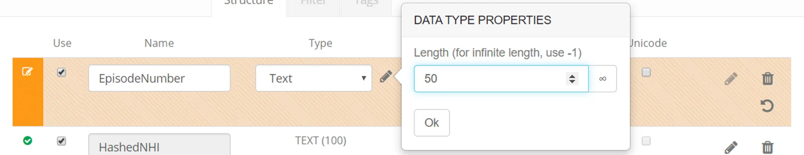
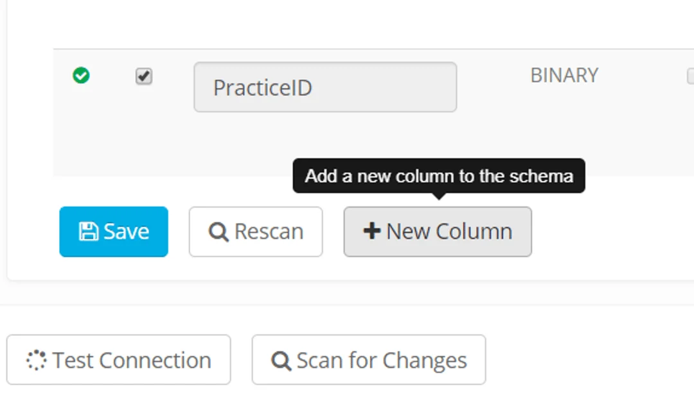
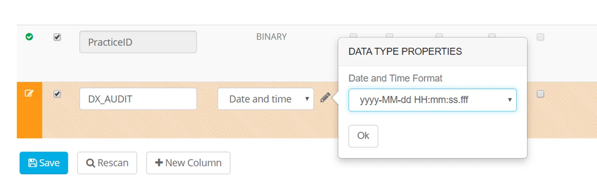
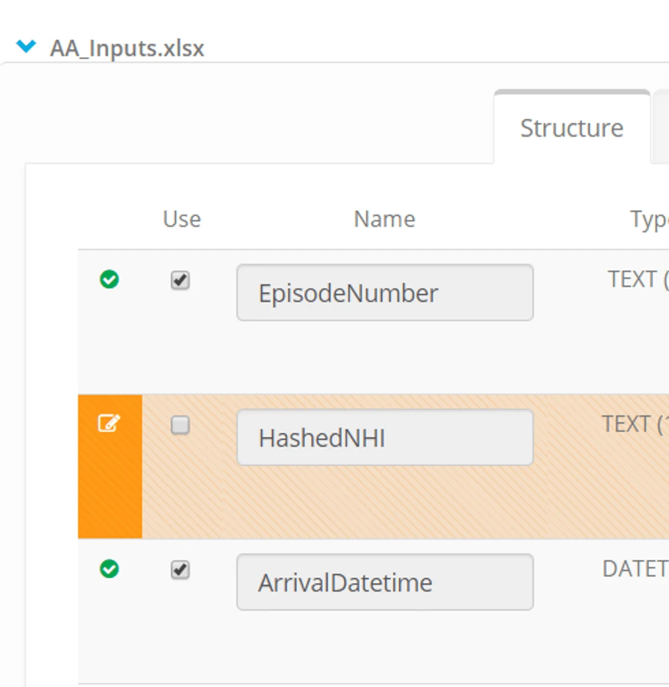
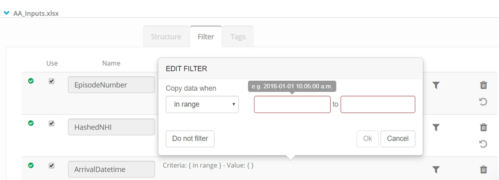

## Browse the Datastore

-   Click on a datastore
-   Select Browse
-   Click the  **\>**  to expand the object and see the column definitions.

If the datastore is created in your Project (not shared from another Project or Account) then you are able to edit Structure, Filters and Tags;

## Edit Structure: existing columns

In the tab named **Structure** click the **Edit pencil icon** against a column.

> *The warning message means that as soon as you change the structure — then the Datastore is now set to Manual Scan. The next time a scan is run — the definition will revert to the structure read from the object.*

Change the attributes as required.

For example you can change the size or data type of a column.

You can define a column as a Primary Key

Click **Save**

## Edit Structure : create new columns

This is useful if you want to define some audit columns in a destination datastore.

Click **\+ New Column**

Enter a column name and define the column attributes

Click **Save**

> *Any change to the structure of a datastore that you save - will switch the datastore to manual scan. Be aware that in the future if the datastore is scanned this can overwrite any manually defined datatypes.*

## Restrict the columns to share in a data transfer process

Untick the check box under *Use* to restrict that column from being processed.

Click **Save**

> *A column not marked* Use *will be visible in a process mapping as restricted — it is not able to be mapped.*

## Filter the data

On the tab named filter click on the filter icon for a column.

The options available will depend on the data type of the column - for example, if the data is a number the filter will only accept a number.

Only rows of data where all the columns meet the filter criteria will be used by Eightwire.

> *Enter a filter without any punctuation marks — the value alone is enough. A range can be entered with values separated by a comma but the filter does not accept 'like' statements.*

## Apply a Tag

A Tag can be created at Project Level to add a definition to a column.

This page shows you how to create your own: [Using Datastore Tags](../using-datastore-tags/)

On the tab labelled **Tags**

Click on a column  to apply a Tag.

Select from the availables tag.

> *The tag PII (Personally Identifiable Information) is available by default in every Project. Applying that tag to a column within a Datastore will mean when a process is created that uses that data, a warning is seen.*

Further information about the use of tags can be found [here](../using-datastore-tags/).

## Want to browse a Datastore now? Check out this video...

<iframe src="https://www.youtube.com/embed/Fb-fWtQdvuQ" title="Eightwire: Browse and Edit a Datastore" loading="lazy" allowfullscreen=""></iframe>

Now you have your Datastore ready you may want to

[Share it to another Organisation or Project](../share-your-datastore/) or [Create a Process](../create-map-and-filter-a-process/)

For more details about the scan of a Datastore refer the [FAQ page about the scan process](../datastore-scan-faqs/)
