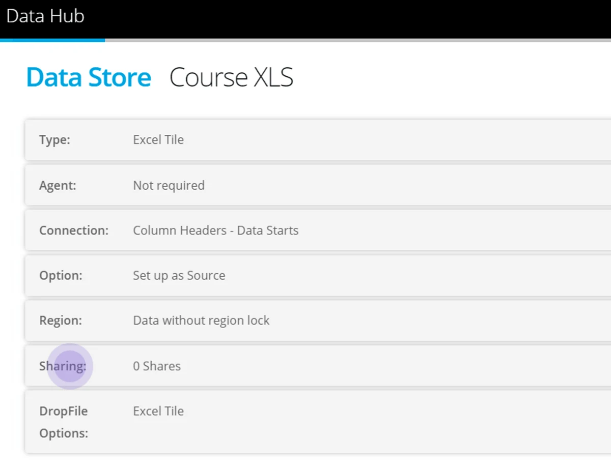
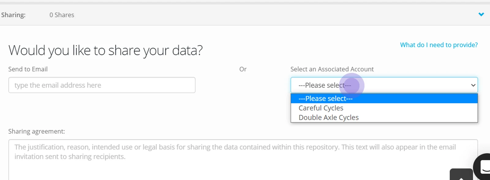
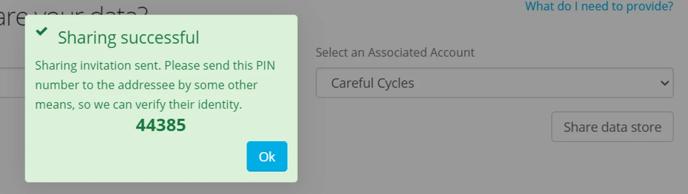
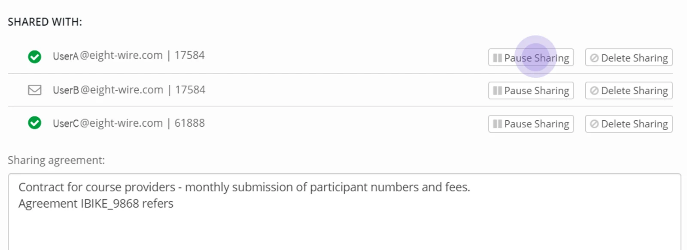

In the Datastore, expand the **Sharing Tab**

To share to a Tile Account you must be associated with them — see our page [Create and Associate with Accounts](../create-and-associate-with-accounts/)

In the Datasharing options select the Organisation Name from the Associated Account Menu.

Complete the sharing agreement test — the text is visible by the recipients when they accept the share.

Click **Save**

Click Share data store to generate the PIN.

Communicate the PIN to the recipient so they can accept the Datastore.

> *When you share to an Associated Account - the invitation will be generated to all the Users in the Account - and the same PIN applies regardless of which User accepts the invitation.*

At any time you are able to Pause or Delete a share invitation — in which case the Tile will not be visible in the Data Provider Account.

Job done! Your data providers can now manually submit data.

To see how the Tile processes report in your Activity Report see [Monitor Tile Activity](../monitor-tile-activity/)
