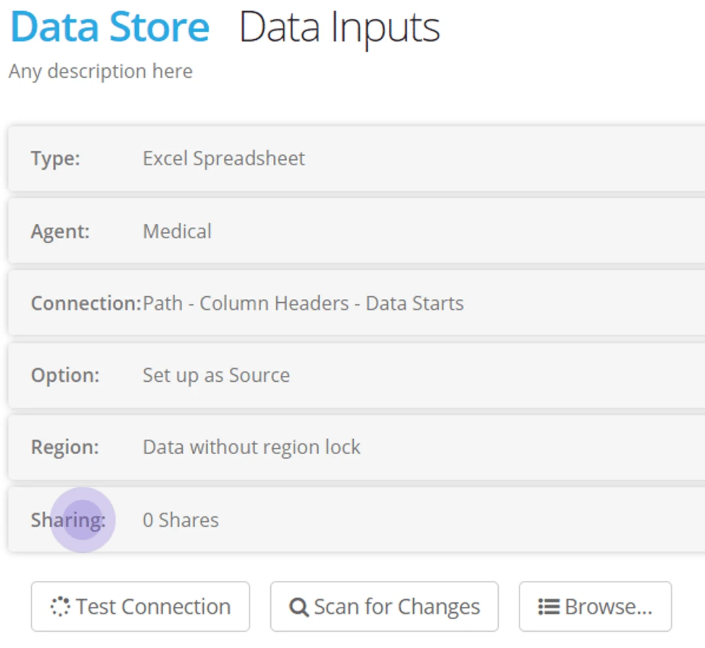
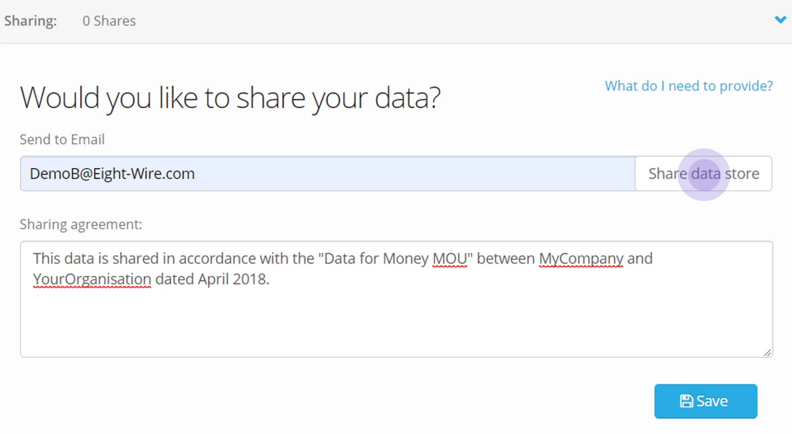
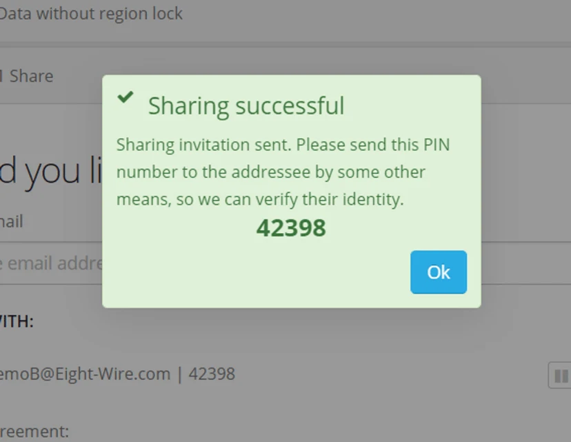
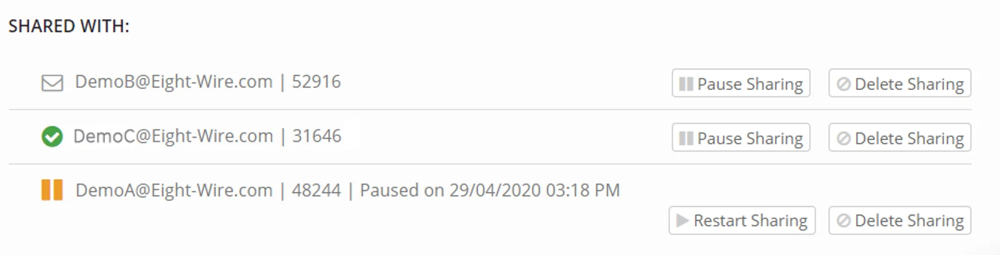
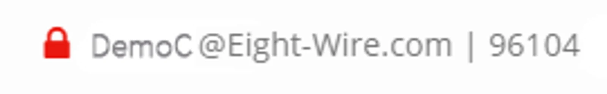

## Creating the Datastore Invitation

To share an existing datastore, select it from the list of all Data Stores within the current Project.

Click on the Datastore and expand the Sharing panel tab.

Enter the email address of the person you wish to share this Data Store with.

Fill in the sharing agreement. This is the reason this data is being shared. The recipient will be agreeing to this when they accept the invitation.

Click **Share data store**

Click **Save**

The data-share invitation email will be sent on your behalf and you will be shown a five-digit PIN.

You should **manually** advise this number to the data sharing recipient. A phone call to the recipient is a great way to confirm that they have received the invitation and to give them the PIN.

A data sharing PIN will expire after 36 hours.

Click **Ok** when finished.

> *If you forget the number, it will be shown on the Sharing panel for this Datastore until you stop sharing this Data Store*

The status of a data share is always shown in the datastore — unopened, received and linked to a Project, or Paused.

Any change you make to the share — such as a new invitation, pause or delete of a datastore — will generate an email to the recipient.

> *At any time you can pause or revoke the datashare and the other party will be notified.*

## Regenerate a Sharing Invitation

If the recipient does not use the correct PIN (after four attempts) they will see a message that they have been locked out of the datastore.

The invitation will appear in the datastore as locked and the recipient should contact you.

You should delete the locked sharing invitation and create a new one — a new email and PIN will be generated.

## For the full tutorial on datastore sharing, check out this video...

<iframe src="https://www.youtube.com/embed/g7u1qU5xuEo" title="Eightwire: Share, pause, delete a Datastore" loading="lazy" allowfullscreen=""></iframe>

If you are the recipient of a data sharing invitation — check out the actions to [accept the share](../accept-a-tile-datashare-invitation/)
