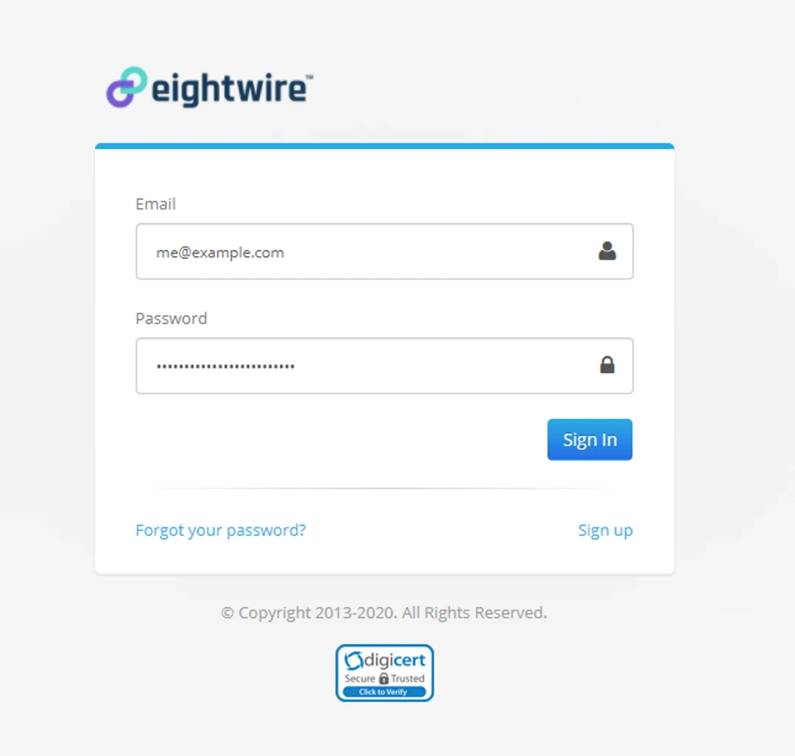
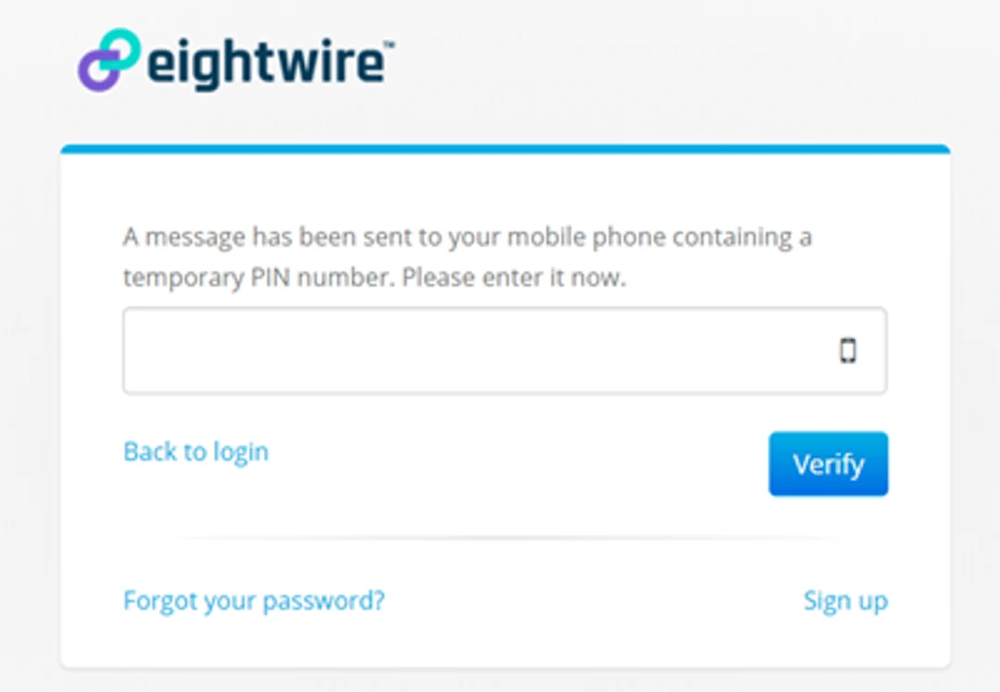
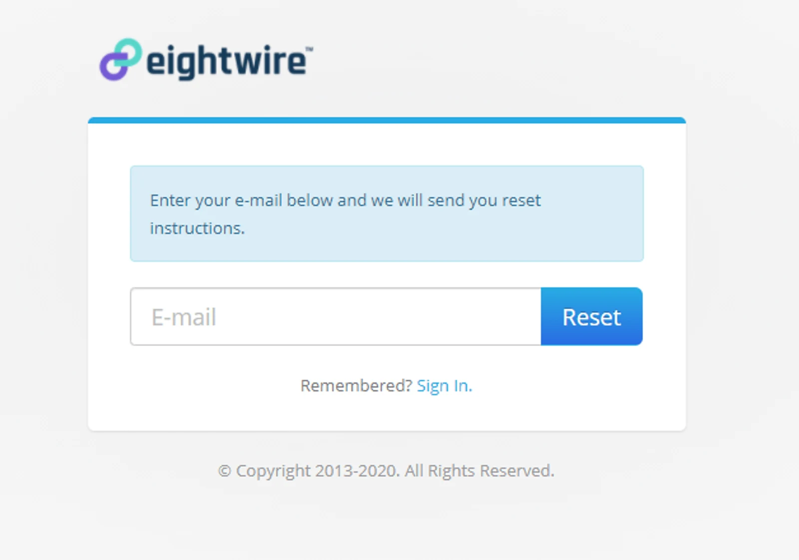
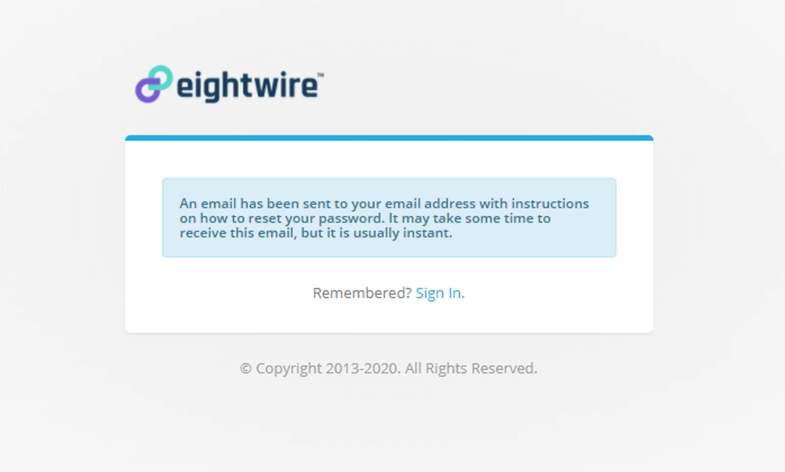
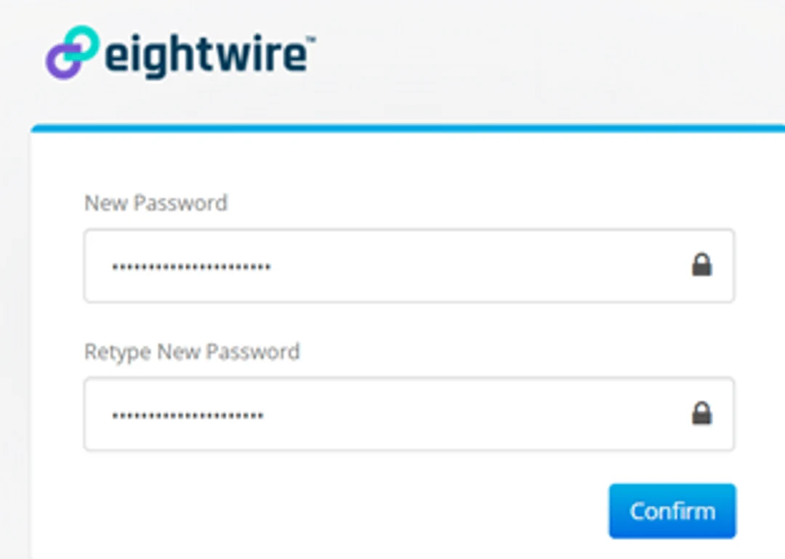

Open your web browser to [**https://conductor.eight-wire.com/**](https://conductor.eight-wire.com/)

Enter your email address and password.

Click **Sign In**.

If your account requires two-factor authentication, an SMS text message will be sent to your mobile phone number, containing a single-use PIN number. Enter this PIN number on the second step of the sign-in process and click the **Verify** button.

If this is the first time your account has been used, you will have to **agree to the Terms and Conditions** before proceeding. You will only need to do this once.

If you agree, check the ‘I Agree’ box and click ‘Continue’.

You should arrive at the Dashboard as shown.

Congratulations, you are now signed in and can begin using Eightwire.

## Forgotten Password

If you have forgotten your password, use the Forgot your password? link on the Sign In page.

Enter your email address.

Click **Reset**.

You will see a confirmation that an email will be sent, provided the email address entered was valid.

Check your email. You should have received an email entitled 'Eightwire Password Reset'.

Open the email and click 'Reset your Eightwire account's password'.

*If you have changed your mind you can cancel the password change by clicking the 'Cancel'*

> *If you try to log in to Eightwire for the first time and see a message 'We are currently setting up your account'. In this case, you should check for the verification email in your inbox or spam folder. The link in the email must be clicked to verify before logging in.*
