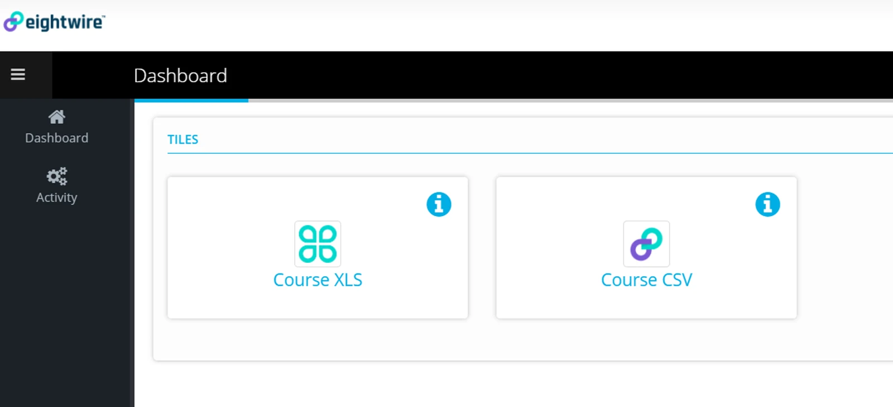
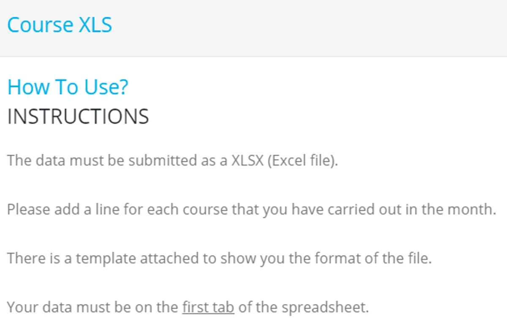
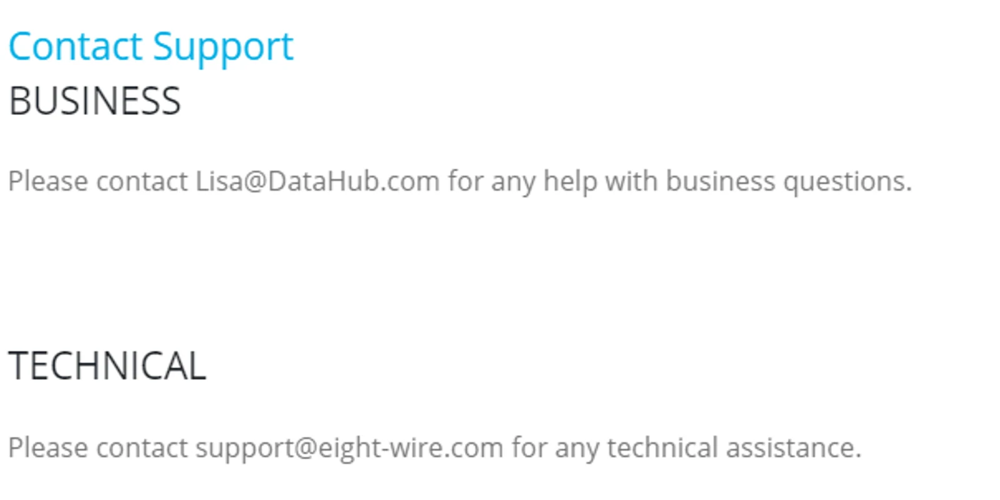
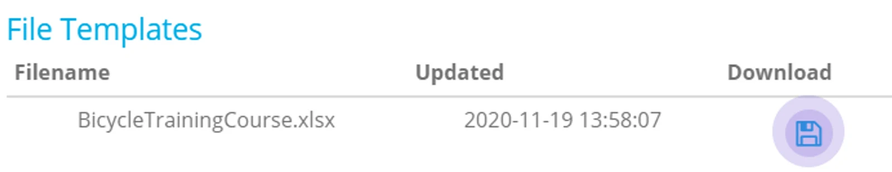
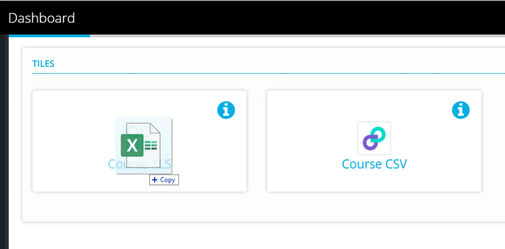
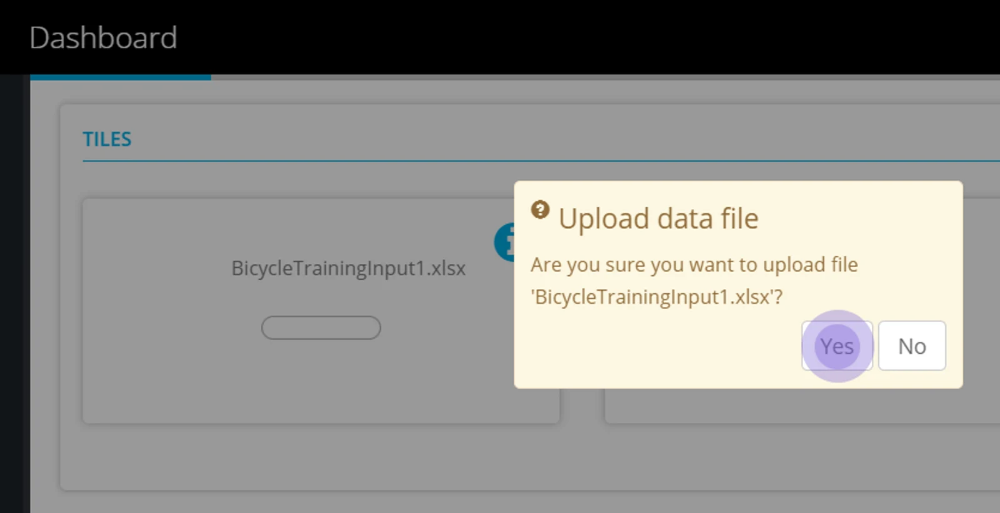
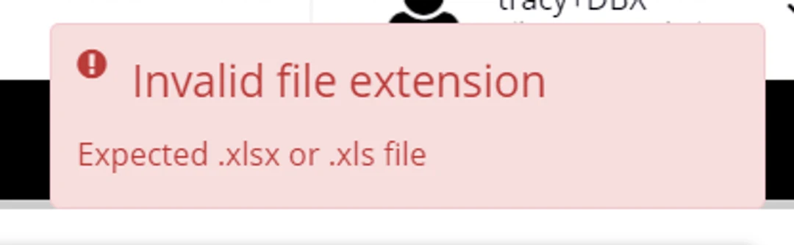
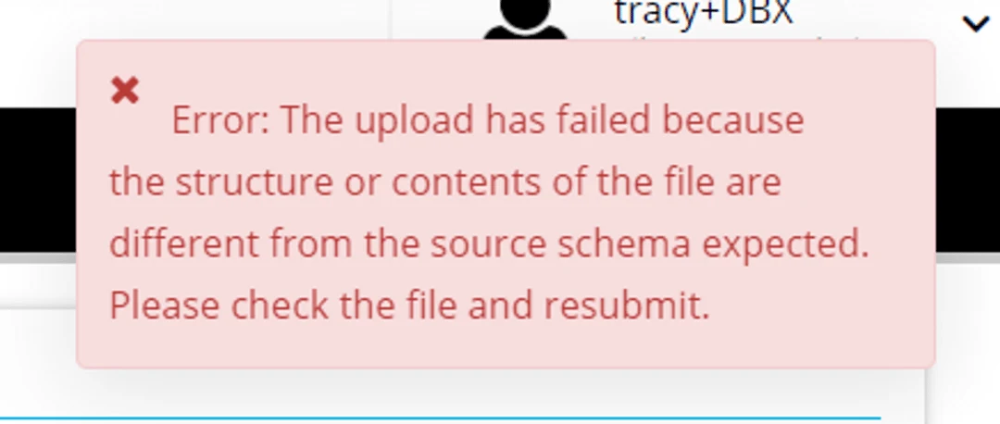
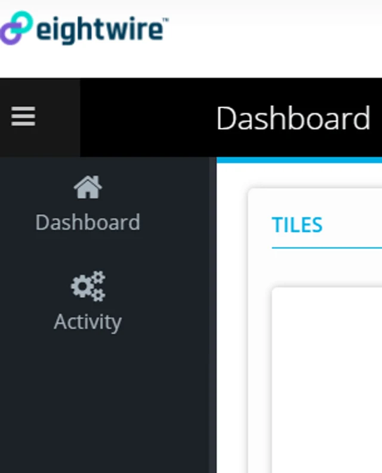

## Tile Information

Click on the blue  **i** symbol to see specific information for each Tile.

The information tab has a section for

**How to Use?**

**Contact Support - Business and Technical**

**File Templates** contain files to use as reporting templates  — click to Download.

## Submit data

To submit data to the tile

drag a file from windows explorer to the tile or click in the tile and browse to the file location on your computer.

Click **Yes** to confirm the upload

If the file does not conform to the structure required a message will show you that the file cannot be downloaded.

If the file conforms to the structure required the message will show

**'A proper data exchange process will begin soon'**

Click on the Activity page link to see the history of your data submissions

The Date, row count, and the person who initiated the share are shown — as well as if the data was loaded successfully at the destination.

Congratulations!

You have submitted your first set of data - at the destination it will be automatically loaded into the database or folder.

To see how to add Users to your Tile Account - check out the page [Tile Account Administration](../tile-account-administration/)
