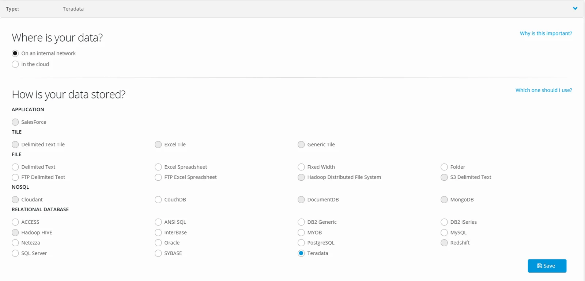

From the Datastore page click **+New**

Name your Datastore and select **Teradata**

**Agent** — Select an Agent

**Connection Protocol** — ODBC

**Connection String**

Driver =\_\_\_\_\_\_\_\_\_\_\_\_\_\_;DBCName=\_\_\_\_\_\_\_\_\_\_\_\_\_;MechanismName=\_\_\_;UID=\_\_\_\_\_\_;PWD=\_\_\_\_\_;

**Schema Name —** Optional

**Option —** Choose Source or Destination

**Region Lock** — Select a processing Region (recommended)

Click **CREATE**
