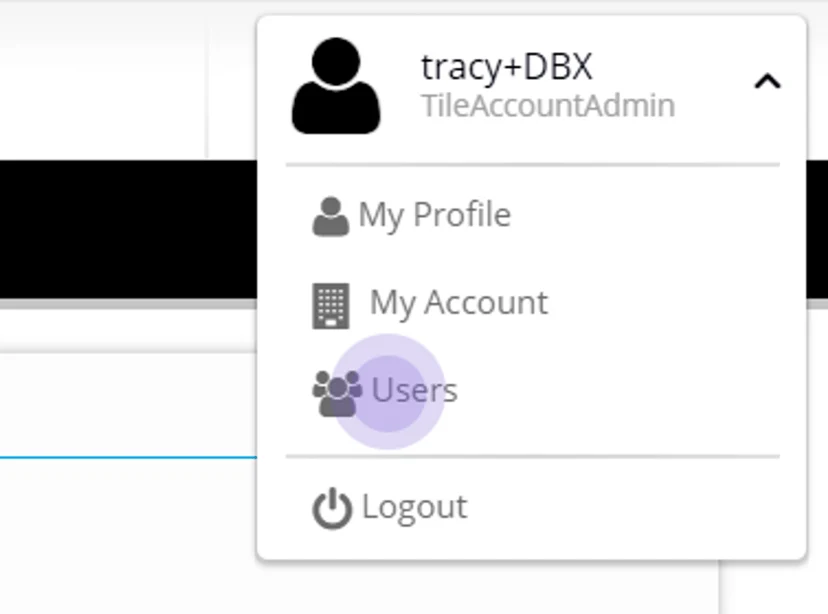
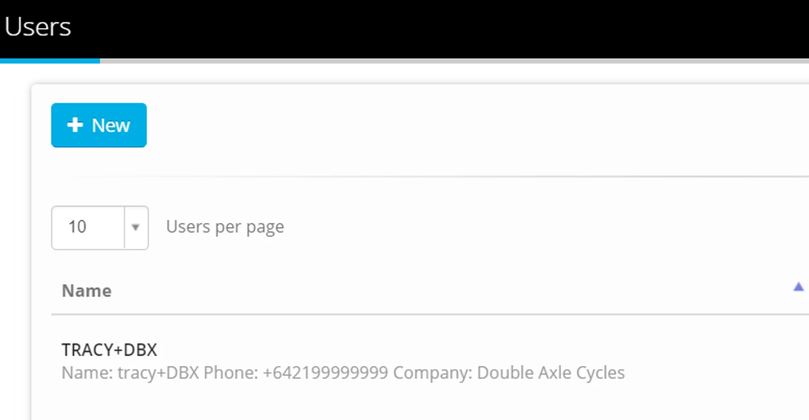
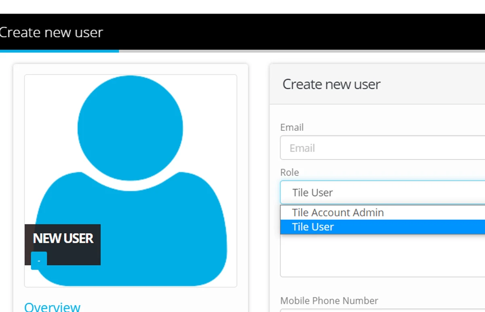
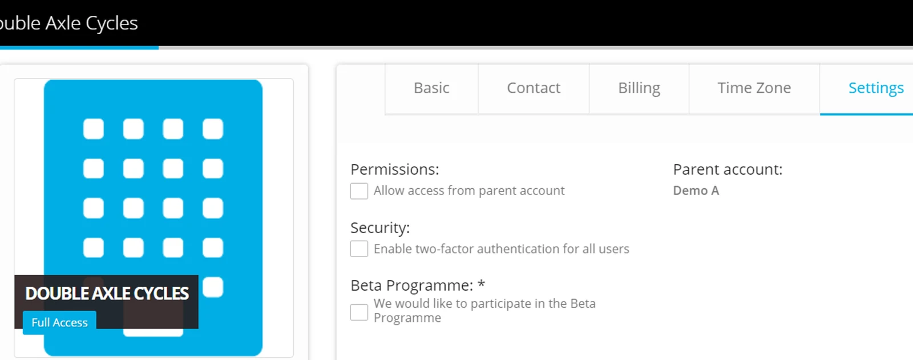

The primary account holder is the email the account was signed up under.

This person has the role of Tile Account Admin and as such can carry out the following tasks:

## Create Users

Go to the Admin section - next to your profile on the top right hand corner, click the arrow to display Admin options

Click **Users**

Click **+New**

Complete Email Address and select a Role

Confirm Mobile and Passwords.

Click **Save**

The User you have just created will receive an email to verify and sign in to the account for the first time.

> *Tile User can submit data but not administer the Account*

## Account Administration

Click **My Account** to confirm the defaulted options

-   Basic
-   Contact
-   Billing
-   Time Zone
-   Settings

To enable Two-Factor Authentication for your Users.

> *For any help with your Administration in your Account - contact* [*support@eight-wire.com*](mailto:support@eight-wire.com)
