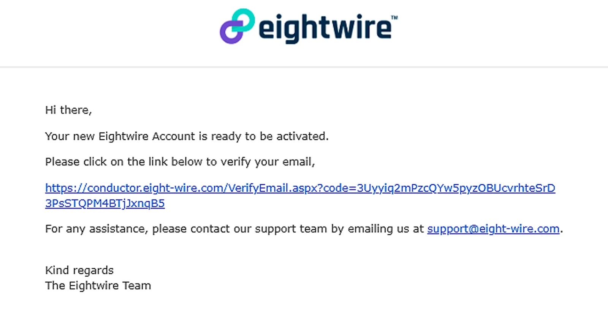
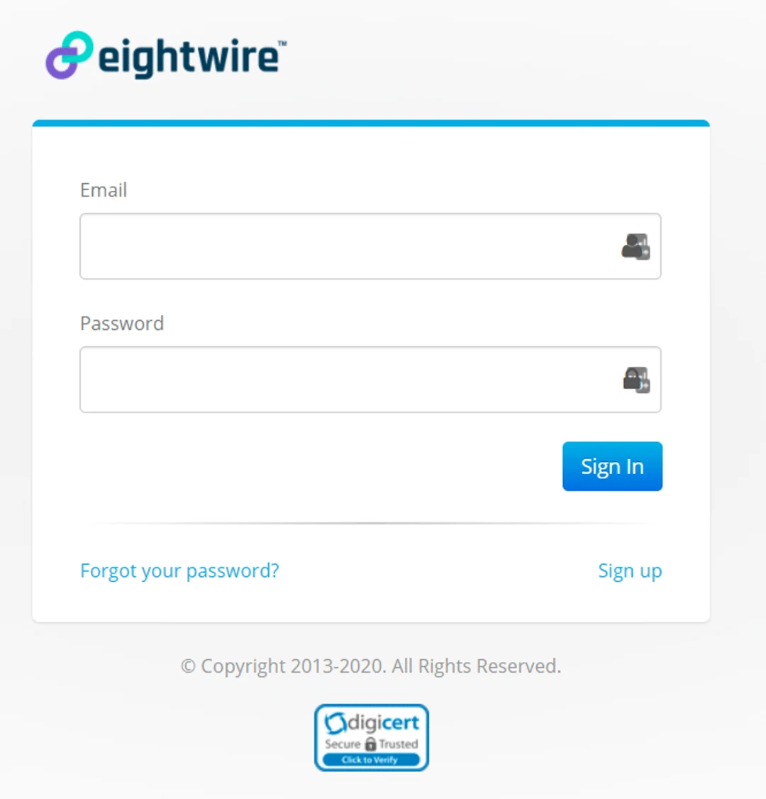
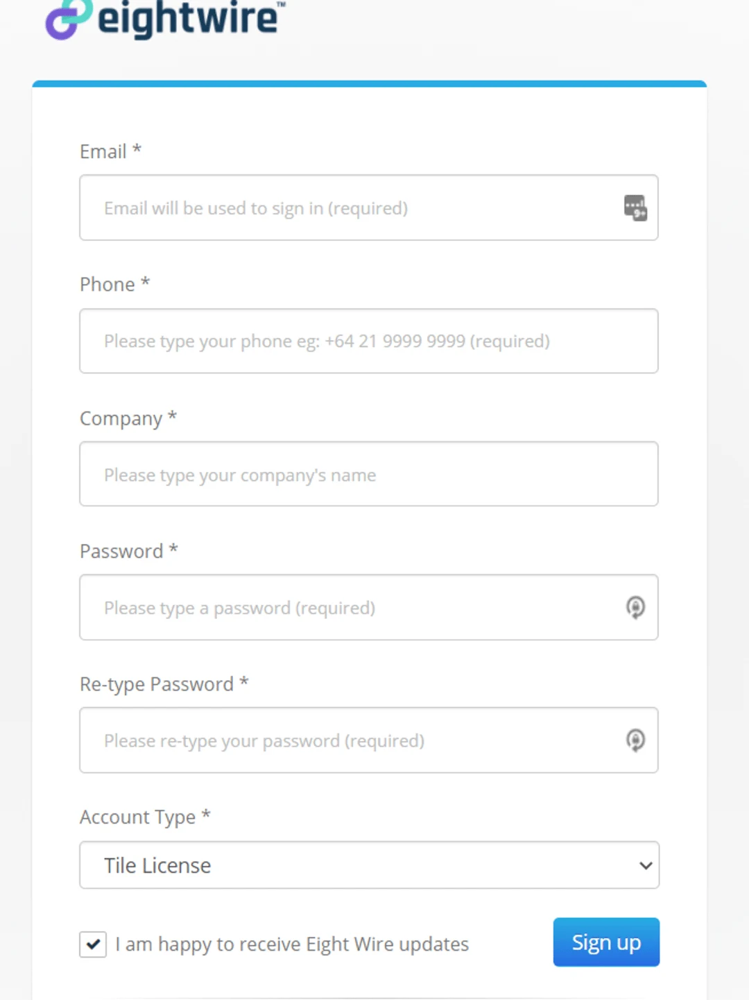
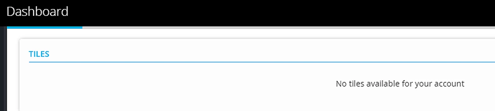

**There are two ways to sign up to a Tile Licence Account; Accept an Invite as an Associated Account, or  Sign up as an Individual Tile License Account**

## Accept an Invite as an Associated Account

If a full license account is sponsoring you as a data provider, they will create a Tile Account for your organisation on your behalf.

You are recognised as being Associated with the sponsor.

On the creation of the Account you will receive an email invitation to confirm the Activation

Click on the link and login to the Eightwire Account (using your email and a password provided by the sponsor account).

Click **Accept** to confirm the Terms and Conditions, and then you will be taken to your Account Dashboard.

> *If you do not have the created password, click on the reset password link to reset and login to your Account.*

## Sign up as an Individual Tile License Account

To sign up to an individual Account, go to our login page to access the Sign Up link

Complete the fields:

Email, Phone, Company, Password

Account Type — select 'Tile Licence' from the dropdown.

Click **Sign up**

Once the Account has been activated, a verification email will be generated allowing you to sign in to your Account for the first time.

Your dashboard will have not Tiles to begin with until you receive Data Sharing invitations.

Check out the process in [Accept a Tile Datashare Invitation](../accept-a-tile-datashare-invitation/)
