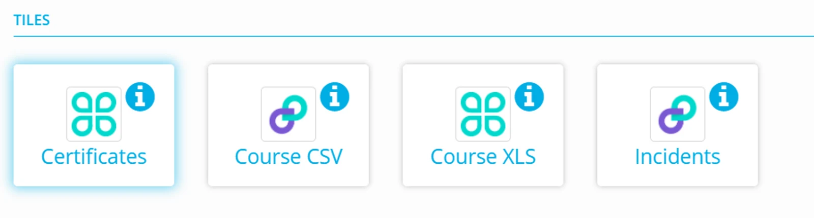

There are three types of tile datastores available:

**Excel** **Tile  —** can be mapped to any destination datastore.

**Delimited Text Tile —** can be mapped to any destination datastore.

**Generic** T**ile —** can be used with any file type (such as word, PDF, or image files) which are mapped to a Folder destination.

The Information section of a tile has configurable text sections for Instructions and  Support.

**Templates** — allows you to upload reporting templates or specifications for your data provider to access.

**Avatar** — allows you to customise the Tile with your organisations branding.
