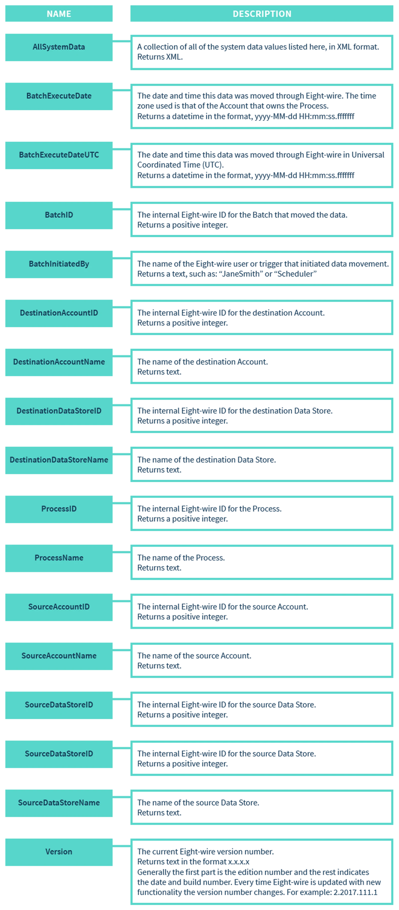
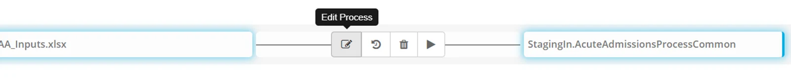
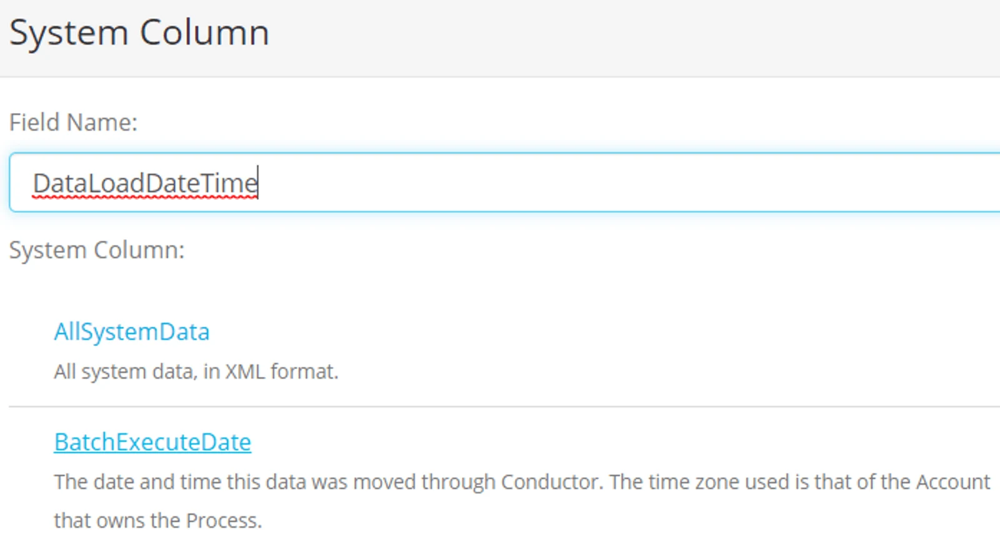
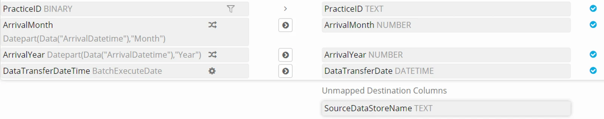

## System Expression

Eightwire has a number of expressions that provide metadata about the data transfer, as follows;

## Assign a system expression to a process

Within a Process Group, hover over a process to edit it.

Click **Edit Process**

Click **+Add System Column**

Assign a field name for the column and select a system column type (for example **BatchExecuteDate** or **BatchID**).

Click **+Add**

Click on the source System Column and then click on a destination column to map them.

Click **Save**

> 💡 Checkout the section on Process Expressions Syntax - to see all the available functions.

## Constants

A constant is a fixed data value — it is not calculated and cannot change. Use a constant in a column where you want to hard code a value into a process that does not exist in the source data.

For example when transferring the type of data into one destination from multiple sources, it may be useful to include the name of the source as a Constant column for each respective Process.

When the data is written to the destination then the constant will be written to the destination column - as mapped in the process.

> *Make sure the Data you use in a Constant - can be written by ensuring it is a TEXT in the destination - you cannot cast a Constant unless you use an Expression instead.*

More options working with processes are in the following pages;

-   Create [Process Expressions](../create-process-expressions/)
-   Configure [Process tolerances and Options](../process-options-thresholds-and-toleration/)
-   Test a Process by [manually executing](../execute-a-process/)
-   Apply [a time based schedule](../process-group-time-schedule/) to your Process Groups
-   Apply [an event based schedule](../process-event-execution-schedule/) to your Process Groups
