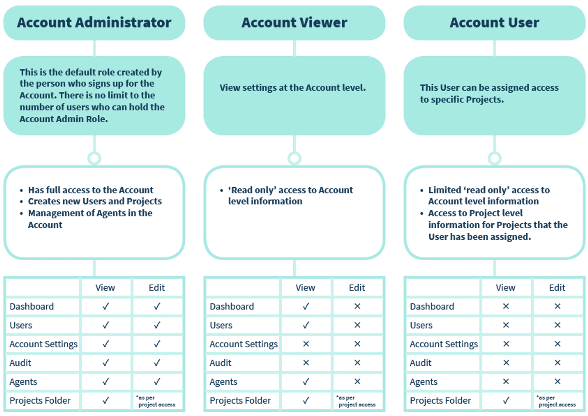
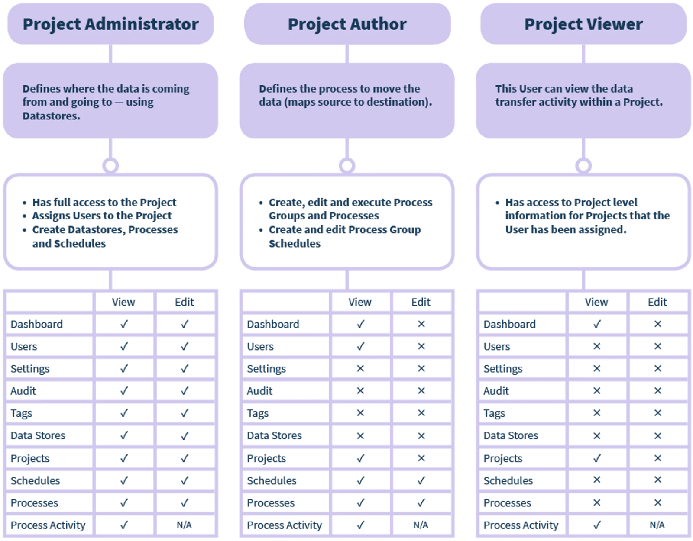

## Role Based Security

**Account Access**

Account Administrators have administration access including being able to edit and create Users.

Be sure to restrict the number of Account Administrators you have.

**Project Access**

Once a User has their Account level role assigned - then assign the level of access to the Projects they need.

When you are you ready to allow Account access to your Users, follow the steps on the page [Create Users](../create-users/)
