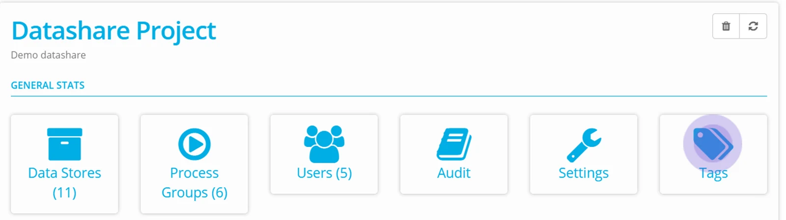
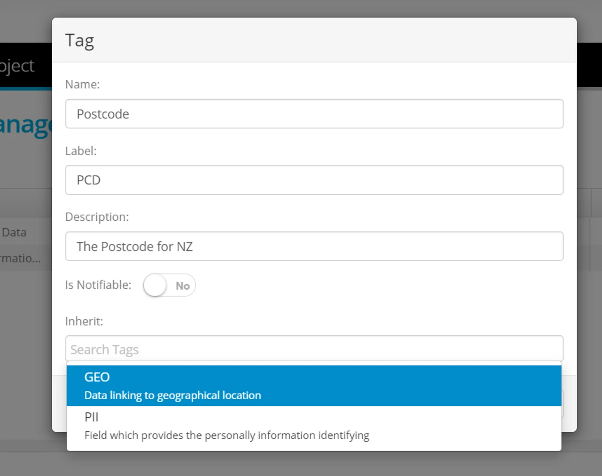
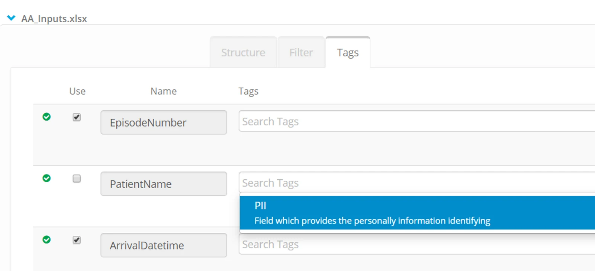
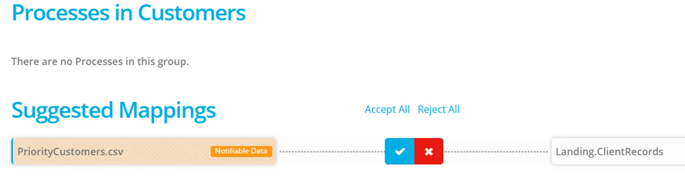
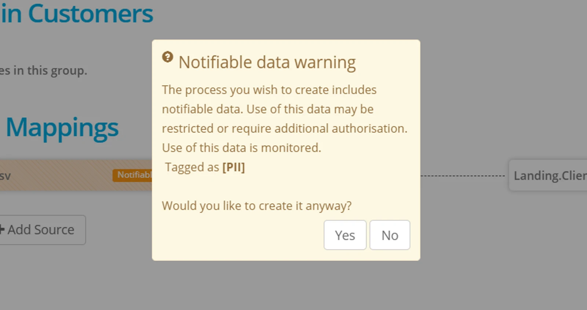
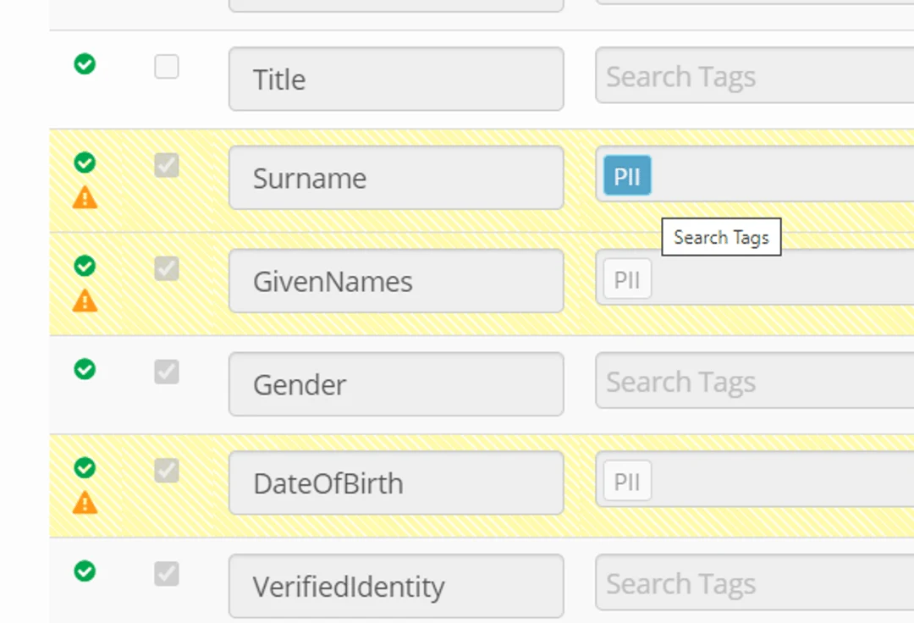

## Create Tags

Go to Project Dashboard and click on **Tags**

To create a new tag, click on the **+** button on the top right hand of the screen.

Complete a Name, Label and Description.

If you want to construct a hierarchy, assign an inheritance from an existing tag.

Use the **Is Notifiable** toggle for alerting an author (in your own account or in an account that you have shared a Datastore with) when the data is used in a new Process.

## Apply a Tag

To apply a tag to a column in your Datastore, browse the datastore and expand an object to define columns.

On the tab called **Tags**

Click on a column  to apply a Tag.

Select from the available tags.

You can apply more than one tag to a column.

## Notifiable Tags and Process creation

> *The tag PII (Personally Identifiable Information) is available by default in every Project. Applying that tag to a column within a Datastore will mean when a process is created that uses that data, a warning is seen.*

If a Datastore (whether external or internal to your Account) is used in a process, the existence of notifiable data is highlighted at the time of building the process.

This is a safeguard to prevent data from being accidentally written to a datastore which allows unrestricted access. For example, production data being written to sandbox or a development environment.

When the source object is selected for a process it shows that notifiable data is tagged.

When the process is accepted, a warning message is shown.

> *The tagged column is a source - is not assigned to a destination in a process.*

## Tags in External Datastores

The tags applied to a Datastore are visible by a  separate Account if you share the Datastore with them — they simply have to browse the shared datastore — and view in the Tags tab.

## Reporting on the Use of Tags

Tags used in data that is processed can be reported on (by an Account that is nominated as the primary account for an Account Group.

This information is exposed in a standard report - refer [Account Group and Communities](../account-group-and-communities/) for more information.
