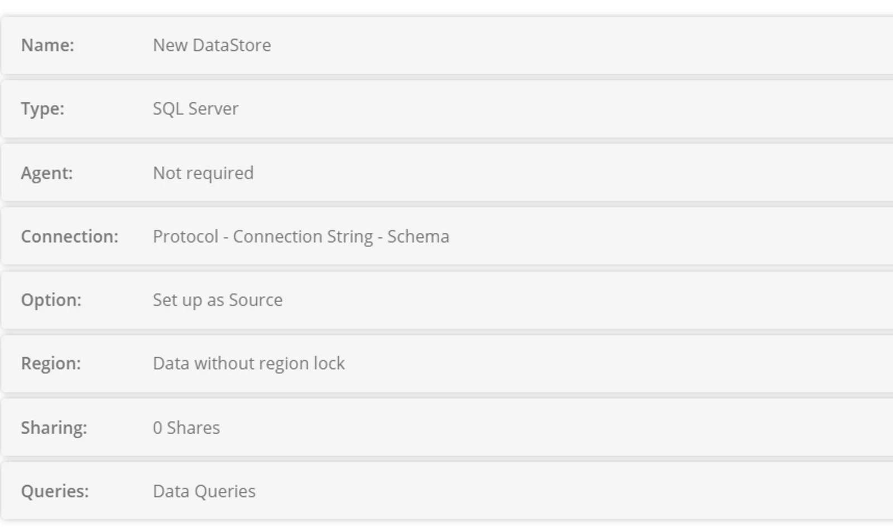

## Datastore Connection Settings

**Where is your Data?  —**  In the Cloud

**Type  —**  SQL Server

**Agent  —**  Not required

**Protocol  —**  SQL Native Client

**Connection String  —**  

Data Source=\_\_\_\_\_\_\_\_\_\_\_\_\_\_\_\_;Initial Catalog=\_\_\_\_\_\_\_;User ID=\_\_\_\_\_\_\_\_\_\_\_\_\_;Password=\_\_\_\_\_\_\_\_\_\_\_\_

or

Data Source=\_\_\_\_\_\_\_\_\_\_\_\_\_\_\_\_;Initial Catalog=\_\_\_\_\_\_\_\_\_\_\_\_\_;Trusted\_Connection=true

## IP Addresses to allow (Agent Controller and Processing Servers)

[agentcontroller.eight-wire.com](http://agentcontroller.eight-wire.com/)                   40.127.77.7

[proc-nz005.eight-wire.com](http://proc-nz005.eight-wire.com/)                         220.247.134.82

[proc-nz006.eight-wire.com](http://proc-nz006.eight-wire.com/)                         103.253.51.48

[proc-us001.eight-wire.com](http://proc-nz006.eight-wire.com/)                          104.42.122.217

[https://proc-au001.eight-wire.com](https://proc-au001.eight-wire.com/Default.aspx)             40.127.74.196
