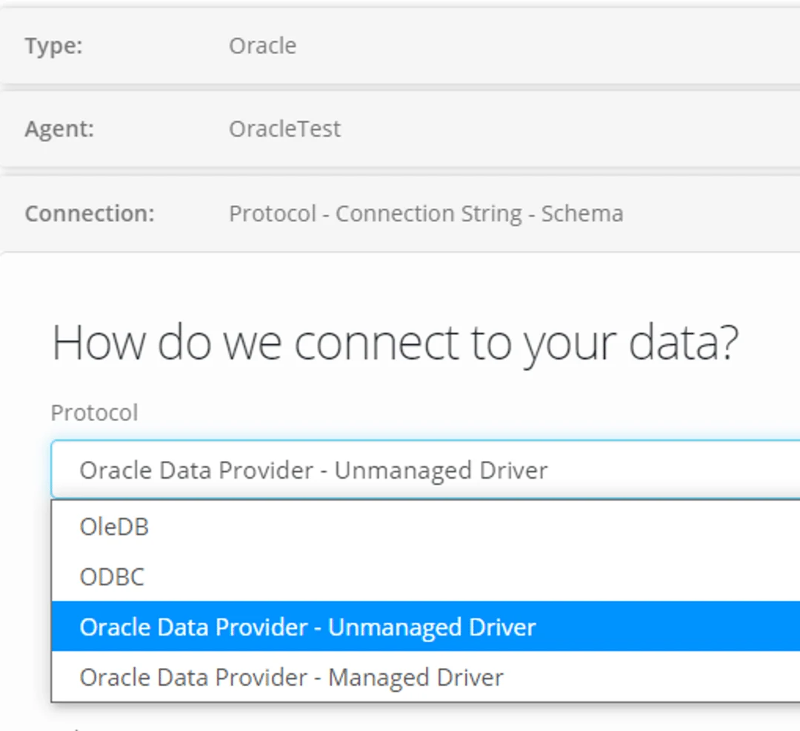

‍**Options to connect to Oracle from Eightwire.**

There are options to allow you to select the appropriate Driver according to your environment, or to use the Eightwire Agent to connect using the managed driver. The information here was verified using Oracle Database 12.2.0.1.0.

## ODP.NET

This option is considered to be the most performant in terms of the tasks required in the data transfer process.

Use the the Protocol dropdown to select Oracle Data Provider Managed or Unmanaged Driver

Connection string examples:

Data Source=\<data source>;User id=\<user id>;Password=\<password>;

*With a trusted connection*

Data Source=\<data source>;Integrated Security=yes

*Further Requirements;*

(If using Unmanaged Driver)

Oracle (.NET Data Provider from Oracle) ODP.Net driver (Oracle.DataAccess needs to have been installed in the Global Assembly Cache (GAC)).

This requires an extra manual step (configure.bat all \<Oracle Home Directory> true true)

## **OLEDB**

Connection string examples;

Oracle OleDB with user id and password (the data source is defined in the tsnames.ora e.g. default is orcl):

Provider=OraOLEDB.Oracle;Data Source=\<data source>;User Id=\<user id>;Password=\<password>

*With a trusted connection*;

Provider=OraOLEDB.Oracle;Data Source=\<system identifier>;OSAuthent=1

## **ODBC**

This Driver the least performant in terms of the tasks required in the data transfer process.

If all the connector information is in the ODBC configuration, only the password is needed.

Connection string examples;

DSN=\<ODBC connector name>;Pwd=\<password>

DSN=\<ODBC connector name>;Uid=\<user id>;Pwd=\<password>

*The ODBC driver from Oracle does not allow a trusted connection*.
